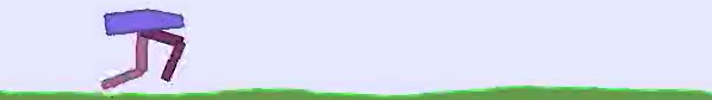
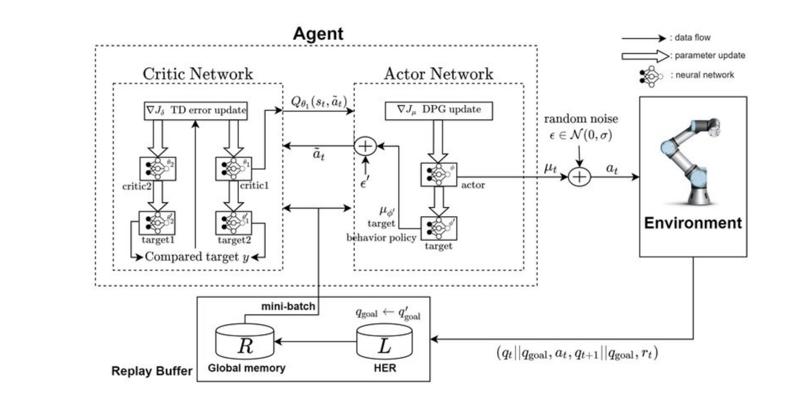
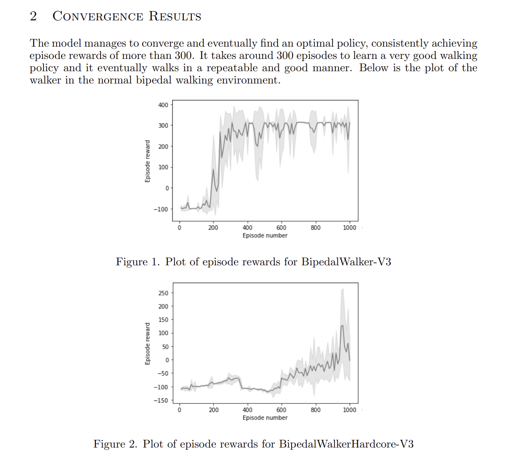

# Training a bipedal walker using TD3

This project details the process of training a bipedal walker using reinforcement learning techniques. The chosen reinforcement learning method will be a twin-delayed deep deterministic policy gradient (TD3) algorithm. TD3 is a model-free and off-policy reinforcement learning method and it will be
used for training in the Open AI gym BipedalWalker-v3 environment and the BipedalWalkerHardcore-v3 environment.

### Environment 
The Bipedal Walker environment is a 2-dimensional training environment which contains a
bipedal creature that must be trained using reinforcement learning methods to achieve the
maximum reward. The maximum reward in this environment is 300 (walk reaches the end
of the environment) and the minimum is -100 (walk falls over); additionally more movement
costs a small amount of points so the optimal policy must be efficient with it’s walk. This
environment is a mostly flat plane, however the hardcore version contains ladders, stump
and pitfalls which makes it significantly harder to train for.
The environment observation/state space is the data that can be used to train the walker
on. It consists of hull angle speed, angular velocity, horizontal speed, vertical speed, position of joints and joints angular speed, legs contact with ground, and 10 lidar rangefinder
measurements. The action space is shown in table 1 and is made up of 4 joints in the range
[-1,1], these are what can be controlled by the actions. Also note that the walker always
starts standing with both legs in the same position with a slight knee angle.

### TD3 Algorithm
The TD3 algorithm learns a policy by storing past exploration of the environment in
a replay buffer and then sampling these experiences. It begins with an initial exploration
phase where the selected actions are random, this populates the replay buffer so that the
actor and critic networks have sufficient information to start training on. The critic and
actor networks contain 3 linear network layers for our input state and actions to be passed
through at each iteration.
Once the actor and critic networks are initialised and we have sufficiently populated
the replay buffer we can begin training. We first sample a batch (of size n) stored
transitions from the replay buffer, we then select an action for each of these states. Each
action has noise added to smooth the policy out, this also requires clipping so we don’t go
too far from the true action value.

Using the states and the actions we can pass these through our critic networks to calculate
a Q value (we select the minimum of the two critic values). This gives us a reward, new
state and a value for the done flag (used to know when an episode is complete).

The loss is then calculated by getting the mean squared error MSE, of each critic value and
the found Q value; we then back propagate using this loss value.

Next the actor must be updated, note that we only update this every n time steps as we
want this to train slower than the critics. We pass the sampled actions and states through
the actor network and get the negative mean of the critic Q values. We optimise for the Q
value by also using back propagation for the actor. We then use then use these updates to
update our target networks, these are used to increase the stability of the algorithm during
training. By getting the maximum value of Q each time and back propagating we refine our
policy using the critic-actor model.

We repeat all of this for a given number of training episodes (e.g. 1000) or until we get an
optimal policy. In each episode we have a maximum number of iterations (e.g. 2000), when
this is reached we stop and update the networks, we also stop when the walker has fallen or
it reaches the end of the environment. Each iteration receives a reward, we calculate this
by passing the environment our calculated action. If the walker goes further and uses less
energy then we get a larger reward and the iteration will have a larger effect on the networks.
After each episode we train our agent for however many iterations were performed, this will
use all of the new transitions stored in the replay buffer. Eventually this should get us to
an optimal TD3 policy for the bipedal walker environment.

### Walker Results

* The two provided videos show the best runs created by each walker.
